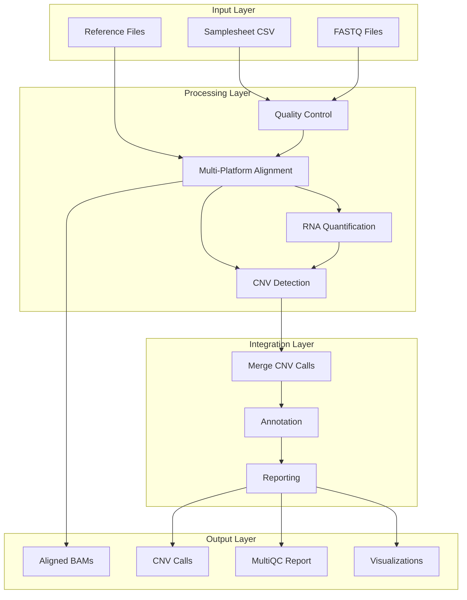
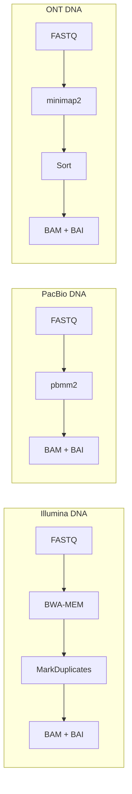
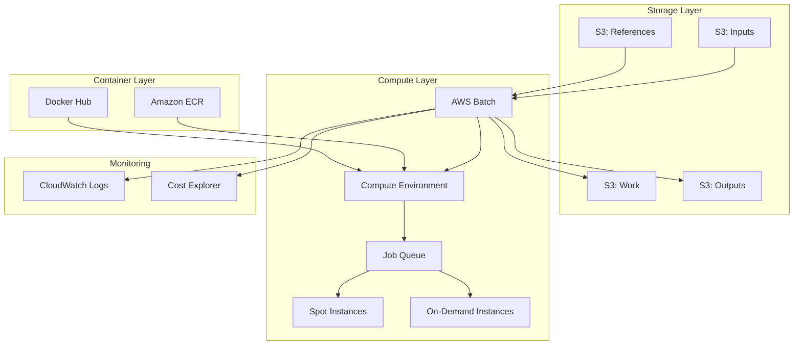

# Pipeline Architecture

## Overview

The Somatic CNV Pipeline implements a modular, cloud-native architecture designed for scalability, reproducibility, and multi-platform support.



## Module Structure

```
somatic-cnv-pipeline/
├── main.nf                    # Main workflow orchestration
├── nextflow.config            # Pipeline configuration
├── modules/                   # Process definitions
│   └── local/
│       ├── bwa/              # BWA alignment modules
│       ├── minimap2/         # Long-read alignment
│       ├── gatk4/            # GATK processes
│       ├── cnvkit/           # CNVkit CNV calling
│       ├── severus/          # Long-read CNV
│       └── casper/           # RNA CNV inference
├── workflows/                 # Sub-workflows
│   ├── prepare_references.nf  # Reference preparation
│   ├── align_dna.nf          # DNA alignment workflow
│   ├── align_rna.nf          # RNA alignment workflow
│   ├── cnv_analysis_dna.nf   # DNA CNV analysis
│   └── cnv_analysis_rna.nf   # RNA CNV analysis
├── conf/                      # Configuration profiles
│   ├── base.config           # Base configuration
│   ├── awsbatch.config       # AWS Batch profile
│   └── test.config           # Test profile
├── bin/                       # Helper scripts
├── assets/                    # Static resources
└── docs/                      # Documentation
```

## Data Flow

### 1. Input Processing
- Samplesheet parsing with validation
- Dynamic channel creation based on platform/datatype
- Automatic pairing of tumor-normal samples

### 2. Platform-Specific Alignment


### 3. CNV Detection Strategy

| Platform | DNA Tools | RNA Tools |
|----------|-----------|-----------|
| Illumina | CNVkit, GATK CNV | CaSpER |
| PacBio | Severus | CaSpER |
| ONT | Severus | CaSpER |

### 4. Integration Pipeline
- Tool-specific outputs normalized to common format
- Consensus calling for overlapping regions
- Annotation with gene information
- Quality metrics aggregation

## AWS Architecture



## Performance Optimization

### 1. Resource Allocation
- Dynamic CPU/memory scaling based on input size
- Platform-specific resource requirements
- Retry strategy with increased resources

### 2. Parallelization
- Scatter-gather for interval-based processing
- Independent sample processing
- Tool-level parallelization (e.g., BWA threads)

### 3. AWS Optimizations
- Spot instances for non-critical processes
- S3 Transfer Acceleration
- Fusion for optimized file access
- Wave for container provisioning

## Quality Control Checkpoints

1. **Input Validation**
   - File existence checks
   - Format validation
   - Metadata consistency

2. **Process-Level QC**
   - Alignment statistics
   - Duplication rates
   - Coverage metrics

3. **Output Validation**
   - CNV call format checking
   - Metric thresholds
   - Report generation

## Extensibility

### Adding New Tools
1. Create module in `modules/local/`
2. Add to appropriate workflow
3. Update integration logic
4. Add container definition

### Adding New Platforms
1. Extend samplesheet schema
2. Add alignment module
3. Add CNV detection module
4. Update channel logic

## Best Practices

1. **Containerization**: All tools in versioned containers
2. **Reproducibility**: Locked versions, documented parameters
3. **Scalability**: Cloud-native design, dynamic resources
4. **Modularity**: Reusable components, clear interfaces
5. **Testing**: Automated CI/CD, multiple test profiles
